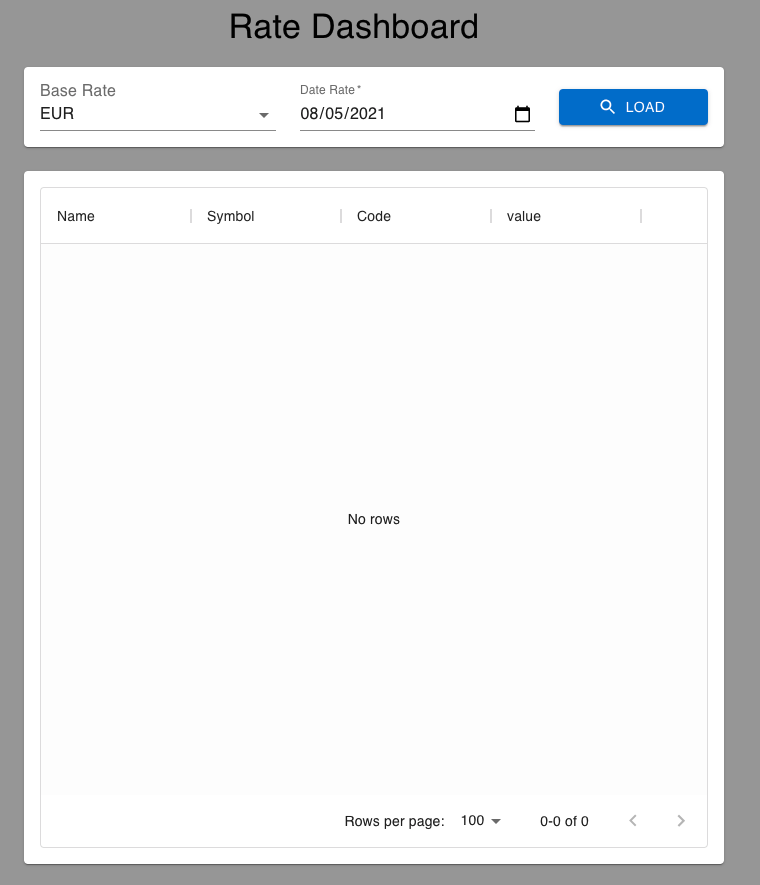
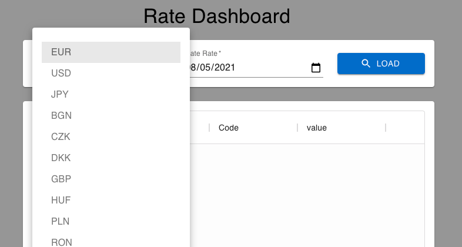
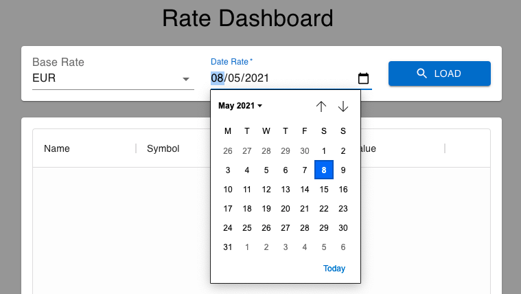
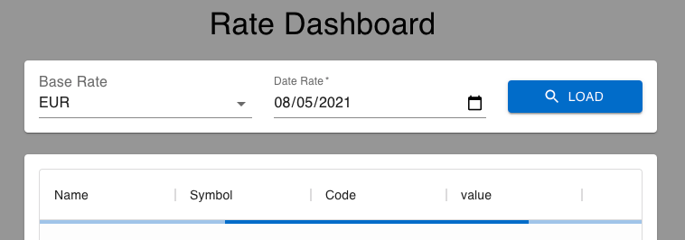
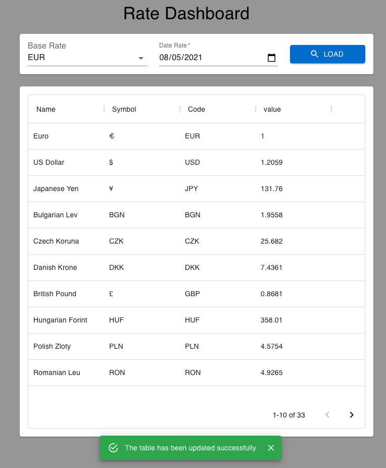
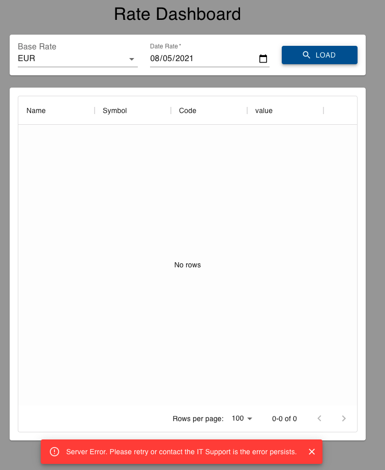
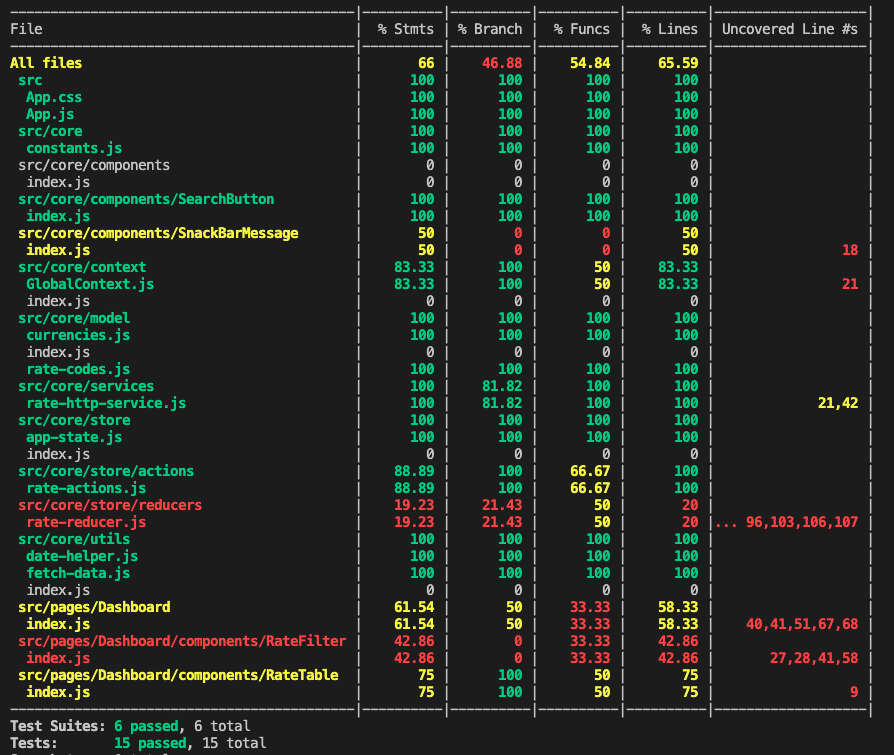

# Requirements

- Ensure to have Node 8 LTS or above.
- run `npm i` to install the dependencies
- run `npm start` to start the application

# Description

This repo contains a currency exchange dashboard. The app displays a list <br />
of currencies based on the params provided by the user. <br /> <br />
Users can set a `base` currency and `date` of reference, once they click the <br />
button `load` a table will be filled with all currencies.

Data is to be retrieved from the following open source API:
<br />[www.vatcomply.com/documentation#rates](https://www.vatcomply.com/documentation#rates).<br />

# Application preview

## Initial view



## The user choose a base rate reference



## The user choose a date rate reference



## The user click on `load` button


## The application display a loader animation



## The application loads the result into the table and displays a success feedback



## The application display an error message in case of issues



# Implementation detail

- React framework is used.
- ReactMaterial UI is used for basic styling, for the Datagrid component <br/>
  and the message feedback
- Application state management uses
  - `useReducer` hook as layer to handle the business logic
  - `redux-saga` to hnadle asyncronous actions
  - `Context API` to share state beween nested components
- Appplication uses `ESlint` to keep code style consistency
- Appplication uses ` JSDOC` to documentate the code and to enforce <br/>
  data type consistency such:

```JS
/**
 * @typedef {{
 *    filter?: {
 *      date?: string
 *      base?: RateCodes
 *    }
 *    feedback?: {
 *      severity: string
 *      message: string
 *      autoHideDuration: number | null
 *    }
 *    rate?: Rate
 *    loading?: boolean
 *    error?: any
 *    tableRate?: RateTableRow []
 * }} AppState
 *
 * */

/** @type {import("../model/rate").AppState} */
const initialState = {
  rate: null,
  loading: false,
  error: null,
  tableRate: [],
};
```

- Appplication uses the tool `husky` to run `npm run lint` before every `git commit` <br/>
  and `npm run test` before every `git push`
- Application was unit tested by using the tool `Jest`. Although the entire <br/>
  application is not fully covered, I implemented different kind of unit testing <br/>
  for the main components and business logic.



## Available Scripts

In the project directory, you can run:

### `npm start`

Runs the app in the development mode.<br />
Open [http://localhost:3000](http://localhost:3000) to view it in the browser.

The page will reload if you make edits.<br />
You will also see any lint errors in the console.

### `npm test`

Launches the test runner in the interactive watch mode.<br />
See the section about [running tests](https://facebook.github.io/create-react-app/docs/running-tests) for more information.

### `npm run build`

Builds the app for production to the `build` folder.<br />
It correctly bundles React in production mode and optimizes the build for the best performance.

The build is minified and the filenames include the hashes.<br />
Your app is ready to be deployed!

# References

## React UI

- [reactjs](https://reactjs.org/)
- [material-ui](https://material-ui.com/)
- [useEffect](https://reactjs.org/docs/hooks-reference.html#useeffect)

## React state manager

- [React Context for Beginners – The Complete Guide (2021)](https://www.freecodecamp.org/news/react-context-for-beginners)
- [Context API](https://reactjs.org/docs/context.html)
- [useContext](https://reactjs.org/docs/hooks-reference.html#usecontext)
- [useReducer](https://reactjs.org/docs/hooks-reference.html#usereducer)
- [redux-saga](https://redux-saga.js.org/)
- [use-saga-reducer](https://www.npmjs.com/package/use-saga-reducer)

## Docs and tools

- [jsdoc](https://jsdoc.app/)
- [eslint](https://eslint.org/)
- [husky](https://typicode.github.io/husky/#/)
